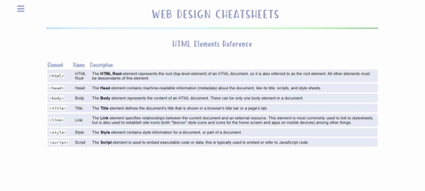
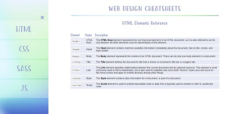

# Build Your Own Cheat Sheet

Build Your Own Cheat Sheet is one of Codecademy's open-ended projects, in which it is encouraged to problem solve and utilize other resources, instead of being provided with step-by-step guidance. The requirements were to create a reference cheatsheet that documented at least one HTML or CSS topic using one or more HTML tables with multiple columns to display the information. We also needed to utilize a custom color scheme and custom styles for any code, such as HTML tags.

## Table of Contents

- [Technologies](#technologies)
- [Screenshots](#screenshots)
- [Status](#status)

## Technologies

This project was created with:

- JavaScript ES6
- HTML5
- CSS3

## Screenshots

## Status

This project has been completed.